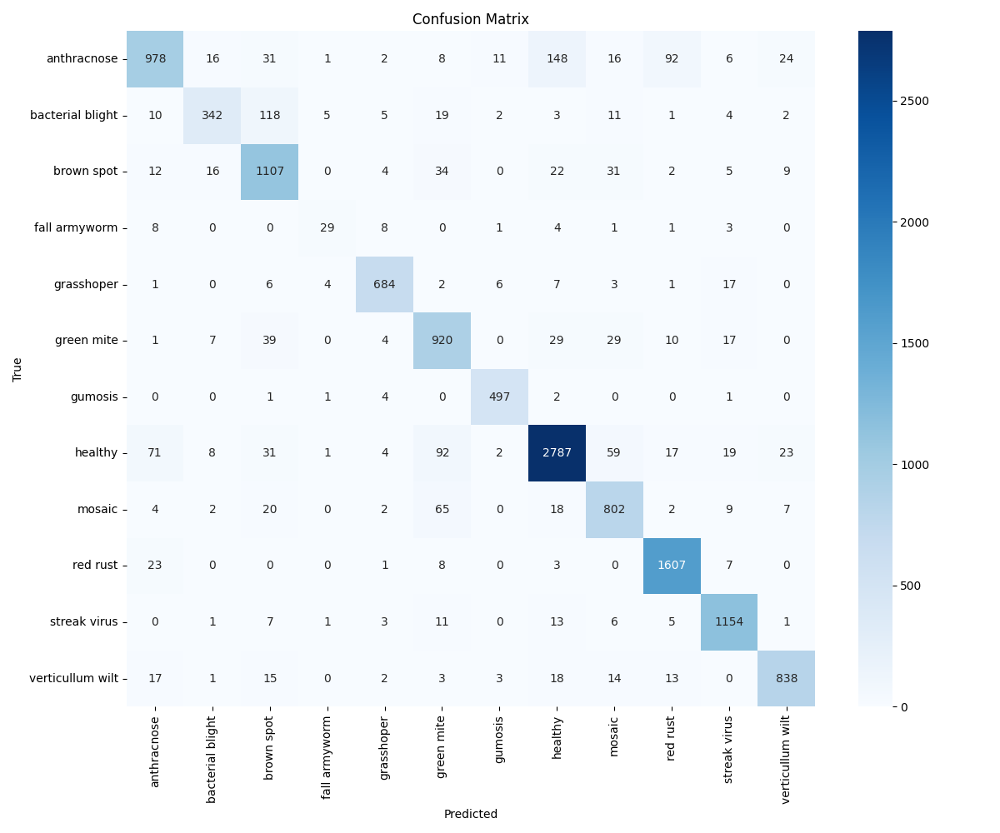
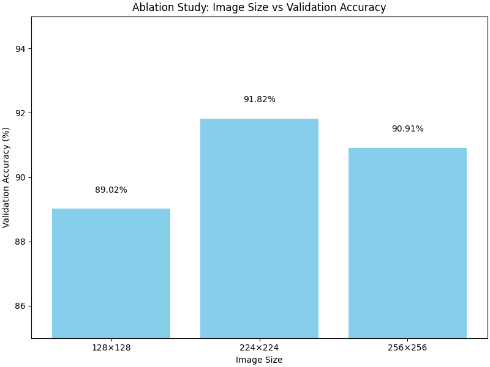
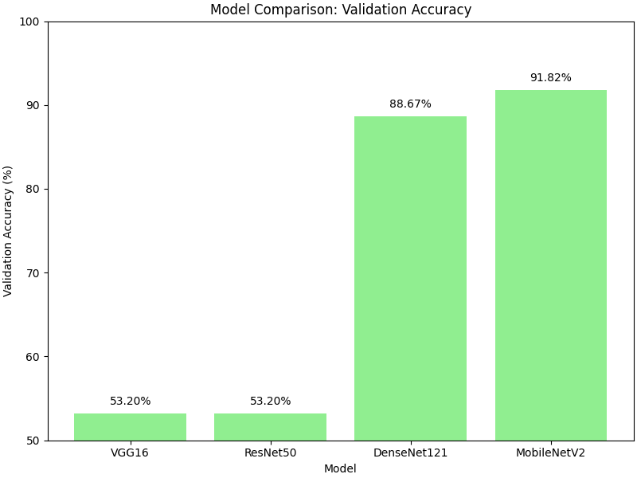

# 🌿 Crop Disease & Pest Detection using MobileNetV2 Transfer Learning

[](https://www.python.org/)
[](https://www.tensorflow.org/)
[]()
[](https://flask.palletsprojects.com/)
[]()
[]()

**Smart Crop Disease Detector** is a deep learning computer vision system designed to diagnose crop plant diseases and pest infestations from leaf images using **MobileNetV2 Transfer Learning**. 

The platform includes a lightweight **Flask Web Diagnostic Portal**, a **Command-Line Inference Tool (`diagnose.py`)**, and an **Evaluation Pipeline (`analysis.py`)** offering ablation studies, confusion matrix generation, and comparative benchmarks against ResNet50 and EfficientNetB0.

---

## 📌 Table of Contents

- [✨ Key Features](#-key-features)
- [🌱 Supported Diseases & Advisory Matrix](#-supported-diseases--advisory-matrix)
- [🧠 Deep Learning Model Architecture](#-deep-learning-model-architecture)
- [📊 Evaluation & Benchmark Visualizations](#-evaluation--benchmark-visualizations)
  - [1. Confusion Matrix](#1-confusion-matrix)
  - [2. Ablation Study (Resolution vs Accuracy)](#2-ablation-study-resolution-vs-accuracy)
  - [3. Model Comparison (MobileNetV2 vs ResNet50 vs EfficientNetB0)](#3-model-comparison-mobilenetv2-vs-resnet50-vs-efficientnetb0)
- [🏗️ System Architecture & Workflow](#%EF%B8%8F-system-architecture--workflow)
- [📂 Directory Structure](#-directory-structure)
- [🚀 Quick Start & Installation](#-quick-start--installation)
- [💻 Usage Guide](#-usage-guide)
  - [Launching the Web Application](#launching-the-web-application)
  - [Running CLI Leaf Diagnosis](#running-cli-leaf-diagnosis)
  - [Training the Model](#training-the-model)
  - [Running Evaluation Analysis](#running-evaluation-analysis)
- [📄 License & Author](#-license--author)

---

## ✨ Key Features

- 🔬 **High-Accuracy Classification**: Classifies **12 distinct crop leaf diseases, fungal infections, viruses, and pest attacks** using MobileNetV2.
- ⚡ **Lightweight & Fast Inference**: MobileNetV2 inverted residual blocks enable real-time inference ($<0.10$ seconds per image), suitable for edge deployment on agricultural handhelds.
- 🌾 **Actionable Agricultural Advisory**: Provides instant actionable treatment recommendations, chemical/biological sprays, and cultural practices for every detected condition.
- 🌐 **Modern Glassmorphic Web Portal**: Responsive Flask web UI featuring drag-and-drop leaf photo uploads, live previews, confidence meters, and diagnostic result cards.
- 💻 **CLI & Batch Diagnosis Engine**: Command-line tool (`diagnose.py`) supporting single-image analysis and multi-file batch directory diagnosis.
- 📈 **Automated Model Analytics**: Integrated scripts for generating multi-class confusion matrices, resolution ablation studies, and model comparison charts.

---

## 🌱 Supported Diseases & Advisory Matrix

| # | Crop Condition / Disease | Classification Type | Actionable Agricultural Treatment Remedy |
|---|--------------------------|---------------------|------------------------------------------|
| 1 | **Anthracnose** | Fungal | Prune infected leaves; apply copper-based fungicides (Bordeaux mixture) every 7-10 days. |
| 2 | **Bacterial Blight** | Bacterial | Use certified disease-free seeds; avoid overhead irrigation; apply copper hydroxide. |
| 3 | **Brown Spot** | Fungal | Apply Mancozeb fungicide; balance nitrogen fertilization; improve canopy airflow. |
| 4 | **Fall Armyworm** | Insect Pest | Deploy pheromone traps; apply neem oil bio-pesticides or Emamectin benzoate sprays. |
| 5 | **Grasshopper** | Insect Pest | Use *Beauveria bassiana* biocontrol agents; install border crop netting. |
| 6 | **Green Mite** | Arachnid Pest | Spray selective miticides or sulfur formulations; prune heavily damaged lower leaves. |
| 7 | **Gummosis** | Fungal Canker | Scrape infected bark tissue; apply Bordeaux paste to bark wounds; improve soil drainage. |
| 8 | **Healthy** | Normal | No treatment required; maintain routine irrigation, fertilization, and crop scouting. |
| 9 | **Mosaic Virus** | Viral Infection | Rogue infected plants immediately; control aphid and whitefly insect vectors. |
| 10 | **Red Rust** | Fungal | Apply copper oxychloride or sulfur dust; eliminate surrounding weed hosts. |
| 11 | **Streak Virus** | Viral Infection | Use certified virus-free seed stock; manage leafhopper vectors using systemic treatments. |
| 12 | **Verticillium Wilt** | Fungal Wilt | Practice multi-year rotation with non-host crops (corn/grasses); solarize soil in summer. |

---

## 🧠 Deep Learning Model Architecture

The core classifier leverages **MobileNetV2 Transfer Learning** pre-trained on ImageNet.

```text
Input Leaf Image (224 x 224 x 3)
              │
              ▼
 MobileNetV2 Feature Extractor (Frozen Base Layers, ImageNet Weights)
              │
              ▼
   GlobalAveragePooling2D
              │
              ▼
   Dense Layer (128 Units, ReLU Activation)
              │
              ▼
   Dense Output Layer (12 Units, Softmax Activation)
              │
              ▼
 Categorical Class Probabilities (12 Crop Diseases)
```

- **Input Shape**: $(224, 224, 3)$ normalized RGB tensor.
- **Optimizer**: Adam ($\text{learning\_rate} = 10^{-4}$).
- **Loss Function**: Categorical Crossentropy.
- **Model Storage**: Saved weights in Keras HDF5 format ([`crop_disease_model.h5`](crop_disease_model.h5)).

---

## 📊 Evaluation & Benchmark Visualizations

### 1. Confusion Matrix
Multi-class confusion matrix detailing true vs. predicted classifications across validation samples:



### 2. Ablation Study (Resolution vs Accuracy)
Evaluation comparing validation accuracy and training latency across image resolutions ($128\times 128$, $224\times 224$, $256\times 256$):



### 3. Model Comparison (MobileNetV2 vs ResNet50 vs EfficientNetB0)
Comparative benchmark evaluating MobileNetV2 against heavy architectures:



---

## 🏗️ System Architecture & Workflow

```text
┌────────────────────────────────────────────────────────────────────────┐
│                      USER INTERACTION INTERFACE                        │
│          (Flask Web Portal  OR  CLI Script: diagnose.py)               │
└───────────────────────────────────┬────────────────────────────────────┘
                                    │
                                    │ Uploads Crop Leaf Photo
                                    ▼
┌────────────────────────────────────────────────────────────────────────┐
│                        PREPROCESSING PIPELINE                          │
│        (Resize to 224x224, Convert RGB, Normalize Pixel Values)        │
└───────────────────────────────────┬────────────────────────────────────┘
                                    │
                                    ▼
┌────────────────────────────────────────────────────────────────────────┐
│                     MOBILENETV2 INFERENCE ENGINE                      │
│                  (Keras Model: crop_disease_model.h5)                  │
└───────────────────────────────────┬────────────────────────────────────┘
                                    │
                                    ▼
┌────────────────────────────────────────────────────────────────────────┐
│                   ADVISORY & METRICS ENGINE                            │
│    - Disease Label & Confidence %                                      │
│    - Actionable Agricultural Treatment Remedy                          │
│    - Model Accuracy Metrics Display                                    │
└────────────────────────────────────────────────────────────────────────┘
```

---

## 📂 Directory Structure

```text
Crop-disease-detection-using-MobilenetV2/
├── .gitattributes               # Git Large File Storage (LFS) configuration
├── .gitignore                   # Git ignore rules for Python & model cache
├── README.md                    # Master project documentation
├── ablation_study_chart.png     # Image resolution ablation study chart
├── analysis.py                  # Evaluation, confusion matrix & benchmark script
├── app.py                       # Flask web application entrypoint & UI
├── class_names.json             # 12 disease class label definitions
├── confusion_matrix.png         # Model confusion matrix plot
├── crop_disease_model.h5        # Pre-trained MobileNetV2 model weights (HDF5)
├── diagnose.py                  # Command line single/batch inference script
├── model_accuracy.json          # Model validation accuracy metadata
├── model_comparison_chart.png   # Model architecture comparison plot
├── requirements.txt             # Python dependencies specification
└── train_model.py               # Model training & fine-tuning script
```

---

## 🚀 Quick Start & Installation

### Prerequisites

- **Python 3.9** or higher installed.

### Installation

1. **Clone the repository**:
   ```bash
   git clone https://github.com/Yojasree1905/Crop-disease-detection-using-MobilenetV2.git
   cd Crop-disease-detection-using-MobilenetV2
   ```

2. **Create & Activate Virtual Environment**:
   ```bash
   # Windows
   python -m venv .venv
   .\.venv\Scripts\activate

   # macOS / Linux
   python3 -m venv .venv
   source .venv/bin/activate
   ```

3. **Install Dependencies**:
   ```bash
   pip install -r requirements.txt
   ```

---

## 💻 Usage Guide

### Launching the Web Application

Start the Flask web server:

```bash
python app.py
```

Open your browser and navigate to: **`http://localhost:5000`**

### Running CLI Leaf Diagnosis

Diagnose a single leaf image from the command line:

```bash
python diagnose.py sample_leaf.jpg
```

Diagnose an entire folder of leaf photos:

```bash
python diagnose.py path/to/leaf_folder/
```

### Training the Model

To train the MobileNetV2 model on your dataset:

1. Place your dataset under `organized_datasets/` (with subfolders per class).
2. Run the training script:
   ```bash
   python train_model.py
   ```

### Running Evaluation Analysis

Generate updated confusion matrix, ablation charts, and model comparison benchmarks:

```bash
python analysis.py
```

---

## 📄 License & Author

Developed for research, academic, and practical agricultural deployment.

- **Author**: Yojasree (`Yojasree1905`)
- **Model**: MobileNetV2 (Transfer Learning)
- **License**: MIT License — open for academic and commercial modification.
